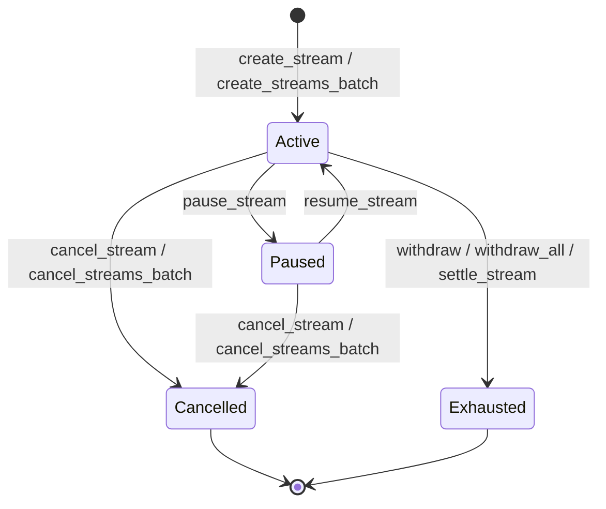

# API Reference

Full documentation for every PayStream contract function: parameters, return values, errors, and CLI examples.

See also: [Error Codes](#error-codes) · [Stream Status Lifecycle](#stream-status-lifecycle) · [Storage Layout](storage-layout.md) (for off-chain indexers)

---

## Stream Contract

### `initialize`

Set the contract admin. Must be called once after deployment before any other function.

Emits a `contract_initialized` event on success so off-chain indexers can determine when and by whom the contract was initialised.

**Caller:** Admin

| Parameter | Type | Description |
|---|---|---|
| `admin` | `Address` | Address that will become the contract admin |

**Returns:** nothing

**Errors:**
- Panics if `admin` auth fails
- Panics with "already initialized" if called more than once (SC-01 / LOW-02)

**Example:**
```bash
stellar contract invoke --id <STREAM_ID> --source <ADMIN_KEY> --network testnet \
  -- initialize --admin <ADMIN_ADDRESS>
```

---

### `propose_admin`

Step 1 of a two-step admin transfer. Current admin nominates a new admin.

**Caller:** Current admin

| Parameter | Type | Description |
|---|---|---|
| `new_admin` | `Address` | Address being nominated as the next admin |

**Returns:** nothing

**Errors:**
- Panics if caller is not the current admin

**Example:**
```bash
stellar contract invoke --id <STREAM_ID> --source <ADMIN_KEY> --network testnet \
  -- propose_admin --new_admin <NEW_ADMIN_ADDRESS>
```

---

### `accept_admin`

Step 2 of a two-step admin transfer. Nominated admin accepts and becomes the new admin.

**Caller:** Nominated (pending) admin

| Parameter | Type | Description |
|---|---|---|
| `new_admin` | `Address` | Must match the address set by `propose_admin` |

**Returns:** nothing

**Errors:**
- Panics if there is no pending admin
- Panics if `new_admin` does not match the pending admin

**Example:**
```bash
stellar contract invoke --id <STREAM_ID> --source <NEW_ADMIN_KEY> --network testnet \
  -- accept_admin --new_admin <NEW_ADMIN_ADDRESS>
```

---

### `pause_contract`

Admin pauses the entire contract. Blocks `create_stream`, `create_streams_batch`, and `withdraw`.

**Caller:** Admin

| Parameter | Type | Description |
|---|---|---|
| `nonce` | `u64` | Current admin nonce (replay protection) |

**Returns:** nothing

**Errors:**
- Panics if caller is not the admin
- Panics if `nonce` does not match the stored nonce (E009)

**Example:**
```bash
stellar contract invoke --id <STREAM_ID> --source <ADMIN_KEY> --network testnet \
  -- pause_contract --nonce 0
```

---

### `unpause_contract`

Admin unpauses the contract, restoring normal operation.

**Caller:** Admin

| Parameter | Type | Description |
|---|---|---|
| `nonce` | `u64` | Current admin nonce (replay protection) |

**Returns:** nothing

**Errors:**
- Panics if caller is not the admin
- Panics if `nonce` does not match the stored nonce (E009)

**Example:**
```bash
stellar contract invoke --id <STREAM_ID> --source <ADMIN_KEY> --network testnet \
  -- unpause_contract --nonce 1
```

---

### `set_min_deposit`

Admin sets the minimum deposit enforced on `create_stream`.

**Caller:** Admin

| Parameter | Type | Description |
|---|---|---|
| `admin` | `Address` | Must equal the stored admin |
| `nonce` | `u64` | Current admin nonce (replay protection) |
| `amount` | `i128` | New minimum deposit (must be > 0) |

**Returns:** nothing

**Errors:**
- Panics if `admin` auth fails or does not match stored admin
- Panics if `nonce` is wrong (E009)
- Panics if `amount` ≤ 0 (E002)

**Example:**
```bash
stellar contract invoke --id <STREAM_ID> --source <ADMIN_KEY> --network testnet \
  -- set_min_deposit --admin <ADMIN_ADDRESS> --nonce 2 --amount 100000
```

---

### `create_stream`

Employer creates a salary stream and deposits funds into the contract escrow.

**Caller:** Employer

| Parameter | Type | Description |
|---|---|---|
| `employer` | `Address` | Employer address; funds are pulled from here |
| `employee` | `Address` | Employee address; receives streamed tokens |
| `token_address` | `Address` | SEP-41 token contract address |
| `deposit` | `i128` | Total tokens to lock in escrow |
| `rate_per_second` | `i128` | Tokens streamed per second |
| `stop_time` | `u64` | Hard stop timestamp (0 = indefinite) |

**Returns:** `u64` — the new stream ID

**Errors:**
- Panics if contract is paused
- E002 if `deposit` ≤ 0
- E007 if `deposit` < minimum deposit
- E001 if `rate_per_second` ≤ 0
- E008 if `rate_per_second` > 1,000,000,000
- Panics if `stop_time` is in the past (when non-zero)
- Panics if `employer` == `employee`
- Panics if token transfer fails (insufficient balance or allowance)

**Example:**
```bash
stellar contract invoke --id <STREAM_ID> --source <EMPLOYER_KEY> --network testnet \
  -- create_stream \
    --employer <EMPLOYER_ADDRESS> \
    --employee <EMPLOYEE_ADDRESS> \
    --token_address <TOKEN_ID> \
    --deposit 1000000 \
    --rate_per_second 100 \
    --stop_time 0
```

---

### `create_streams_batch`

Employer creates multiple salary streams atomically. All streams succeed or all revert.

**Caller:** Employer

| Parameter | Type | Description |
|---|---|---|
| `employer` | `Address` | Employer address |
| `params` | `Vec<StreamParams>` | List of stream parameters (see below) |

**`StreamParams` fields:**

| Field | Type | Description |
|---|---|---|
| `employee` | `Address` | Employee address |
| `token` | `Address` | SEP-41 token contract address |
| `deposit` | `i128` | Deposit for this stream |
| `rate_per_second` | `i128` | Tokens per second for this stream |
| `stop_time` | `u64` | Hard stop timestamp (0 = indefinite) |

**Returns:** `Vec<u64>` — list of new stream IDs in the same order as `params`

**Errors:** Same per-stream validations as `create_stream`; panics if `params` is empty

**Example:**
```bash
stellar contract invoke --id <STREAM_ID> --source <EMPLOYER_KEY> --network testnet \
  -- create_streams_batch \
    --employer <EMPLOYER_ADDRESS> \
    --params '[{"employee":"<ADDR1>","token":"<TOKEN_ID>","deposit":500000,"rate_per_second":50,"stop_time":0},{"employee":"<ADDR2>","token":"<TOKEN_ID>","deposit":500000,"rate_per_second":50,"stop_time":0}]'
```

---

### `withdraw`

Employee withdraws all claimable tokens earned so far.

**Caller:** Employee

| Parameter | Type | Description |
|---|---|---|
| `employee` | `Address` | Must match the stream's employee |
| `stream_id` | `u64` | ID of the stream to withdraw from |

**Returns:** `i128` — amount transferred (0 if nothing claimable)

**Errors:**
- Panics if contract is paused
- Panics if stream not found
- Panics if caller is not the stream's employee
- Panics if stream is not Active or Exhausted
- E003 if a reentrant withdraw is detected

**Example:**
```bash
stellar contract invoke --id <STREAM_ID> --source <EMPLOYEE_KEY> --network testnet \
  -- withdraw --employee <EMPLOYEE_ADDRESS> --stream_id 1
```

---

### `withdraw_all`

Employee withdraws all claimable tokens from every stream they receive in a single transaction. Auth is checked once. Cancelled and Paused streams are silently skipped; streams with nothing claimable are also skipped.

**Caller:** Employee

| Parameter | Type | Description |
|---|---|---|
| `employee` | `Address` | Employee address (requires auth, checked once) |

**Returns:** `Vec<(u64, i128)>` — list of `(stream_id, amount_withdrawn)` pairs for every stream from which tokens were transferred; empty if nothing was claimable

**Errors:**
- Panics if contract is paused
- E003 if a reentrant withdraw is detected on any stream

**Gas note:** Each stream in the employee's index incurs one `token::transfer` cross-contract call. For a 10-stream portfolio this is roughly 10× the cost of a single `withdraw` call; plan accordingly for large indexes.

**Example:**
```bash
stellar contract invoke --id <STREAM_ID> --source <EMPLOYEE_KEY> --network testnet \
  -- withdraw_all --employee <EMPLOYEE_ADDRESS>
```

---

Employer adds more funds to an active stream.

**Caller:** Employer

| Parameter | Type | Description |
|---|---|---|
| `employer` | `Address` | Must match the stream's employer |
| `stream_id` | `u64` | ID of the stream to top up |
| `amount` | `i128` | Additional tokens to deposit |

**Returns:** nothing

**Errors:**
- Panics if stream not found
- Panics if caller is not the stream's employer
- E005 if stream is Cancelled
- E006 if stream is Exhausted
- Panics if `amount` ≤ 0
- Panics if token transfer fails

**Example:**
```bash
stellar contract invoke --id <STREAM_ID> --source <EMPLOYER_KEY> --network testnet \
  -- top_up --employer <EMPLOYER_ADDRESS> --stream_id 1 --amount 500000
```

---

### `pause_stream`

Employer pauses an active stream. Accrual stops until `resume_stream` is called.

**Caller:** Employer

| Parameter | Type | Description |
|---|---|---|
| `employer` | `Address` | Must match the stream's employer |
| `stream_id` | `u64` | ID of the stream to pause |

**Returns:** nothing

**Errors:**
- Panics if stream not found
- Panics if caller is not the stream's employer
- Panics if stream is not Active

**Example:**
```bash
stellar contract invoke --id <STREAM_ID> --source <EMPLOYER_KEY> --network testnet \
  -- pause_stream --employer <EMPLOYER_ADDRESS> --stream_id 1
```

---

### `resume_stream`

Employer resumes a paused stream. The `last_withdraw_time` is reset to now so paused time is excluded from accrual.

**Caller:** Employer

| Parameter | Type | Description |
|---|---|---|
| `employer` | `Address` | Must match the stream's employer |
| `stream_id` | `u64` | ID of the stream to resume |

**Returns:** nothing

**Errors:**
- Panics if stream not found
- Panics if caller is not the stream's employer
- Panics if stream is not Paused

**Example:**
```bash
stellar contract invoke --id <STREAM_ID> --source <EMPLOYER_KEY> --network testnet \
  -- resume_stream --employer <EMPLOYER_ADDRESS> --stream_id 1
```

---

### `update_rate`

Employer changes the `rate_per_second` of an Active or Paused stream without cancelling and recreating it.

Before applying the new rate, any tokens accrued since the last withdrawal are settled by resetting `last_withdraw_time` to the current ledger timestamp. The employee is credited at the old rate for all elapsed time; future accrual uses the new rate.

**Caller:** Employer

| Parameter | Type | Description |
|---|---|---|
| `employer` | `Address` | Must match the stream's employer |
| `stream_id` | `u64` | ID of the stream to update |
| `new_rate` | `i128` | New tokens-per-second rate (1 – 1,000,000,000) |

**Returns:** nothing

**Errors:**
- Panics if stream not found
- Panics if caller is not the stream's employer
- Panics if stream is not Active or Paused
- E001 if `new_rate` ≤ 0
- E008 if `new_rate` > 1,000,000,000

**Emitted event:** `rate_updated(stream_id, old_rate, new_rate)`

**Example:**
```bash
stellar contract invoke --id <STREAM_ID> --source <EMPLOYER_KEY> --network testnet \
  -- update_rate --employer <EMPLOYER_ADDRESS> --stream_id 1 --new_rate 20
```

---

### `cancel_stream`

Employer cancels a stream. The employee receives all earned tokens; the employer is refunded the remainder.

**Caller:** Employer

| Parameter | Type | Description |
|---|---|---|
| `employer` | `Address` | Must match the stream's employer |
| `stream_id` | `u64` | ID of the stream to cancel |

**Returns:** nothing

**Errors:**
- Panics if stream not found
- Panics if caller is not the stream's employer
- Panics if stream is already Cancelled or Exhausted

**Emitted event:** `stream_cancelled` (enriched — see [Events](#events) section)

**Example:**
```bash
stellar contract invoke --id <STREAM_ID> --source <EMPLOYER_KEY> --network testnet \
  -- cancel_stream --employer <EMPLOYER_ADDRESS> --stream_id 1
```

---

### `cancel_streams_batch`

Employer cancels multiple streams atomically in a single transaction. All cancellations succeed or all revert. Cheaper than N individual `cancel_stream` calls for N ≥ 2.

**Caller:** Employer

| Parameter | Type | Description |
|---|---|---|
| `employer` | `Address` | Must own every stream in the list (requires auth once) |
| `stream_ids` | `Vec<u64>` | IDs of streams to cancel; must not be empty |

**Returns:** nothing

**Errors:**
- Panics if `stream_ids` is empty
- Panics if any stream is not found
- Panics if any stream does not belong to `employer`
- Panics if any stream is already Cancelled or Exhausted (reverts entire batch)

**Example:**
```bash
stellar contract invoke --id <STREAM_ID> --source <EMPLOYER_KEY> --network testnet \
  -- cancel_streams_batch --employer <EMPLOYER_ADDRESS> --stream_ids '[1,2,3]'
```

---

### `get_stream`

Read the full state of a stream by ID.

**Caller:** Anyone

| Parameter | Type | Description |
|---|---|---|
| `stream_id` | `u64` | ID of the stream to read |

**Returns:** `Stream` — the stream struct

**`Stream` fields:**

| Field | Type | Description |
|---|---|---|
| `id` | `u64` | Stream ID |
| `employer` | `Address` | Employer address |
| `employee` | `Address` | Employee address |
| `token` | `Address` | Token contract address |
| `deposit` | `i128` | Total deposited |
| `withdrawn` | `i128` | Total already withdrawn |
| `rate_per_second` | `i128` | Tokens streamed per second |
| `start_time` | `u64` | Ledger timestamp when stream started |
| `stop_time` | `u64` | Hard stop timestamp (0 = none) |
| `last_withdraw_time` | `u64` | Timestamp of last withdrawal or resume |
| `status` | `StreamStatus` | Active / Paused / Cancelled / Exhausted |
| `locked` | `bool` | Reentrancy guard (always false at rest) |

**Errors:**
- Panics if stream not found

**Example:**
```bash
stellar contract invoke --id <STREAM_ID> --source <ANY_KEY> --network testnet \
  -- get_stream --stream_id 1
```

---

### `stream_status`

Query only the status of a stream by ID. Lighter than `get_stream` for read-heavy off-chain
indexers that only need to know whether a stream is Active, Paused, Cancelled, or Exhausted (SC-06).

**Caller:** Anyone

| Parameter | Type | Description |
|---|---|---|
| `stream_id` | `u64` | ID of the stream to query |

**Returns:** `StreamStatus` — one of `Active`, `Paused`, `Cancelled`, `Exhausted`

**Errors:**
- Panics with "stream not found" if no stream exists for `stream_id`

**Example:**
```bash
stellar contract invoke --id <STREAM_ID> --source <ANY_KEY> --network testnet \
  -- stream_status --stream_id 1
```

---

### `claimable`

Query how many tokens the employee can withdraw right now.

**Caller:** Anyone

| Parameter | Type | Description |
|---|---|---|
| `stream_id` | `u64` | ID of the stream to query |

**Returns:** `i128` — claimable token amount

**Formula:**
```
claimable = min(
    (now - last_withdraw_time) * rate_per_second,
    deposit - withdrawn
)
```
Time is capped at `stop_time` when set. Returns 0 for Cancelled or Exhausted streams.

**Errors:**
- Panics if stream not found

**Example:**
```bash
stellar contract invoke --id <STREAM_ID> --source <ANY_KEY> --network testnet \
  -- claimable --stream_id 1
```

#### Worked examples

Each example mirrors a scenario covered in `contracts/stream/src/test.rs`.

**1. Normal accrual** — `deposit = 1_000`, `rate_per_second = 10`, `stop_time = 0`, `last_withdraw_time = 0`, `withdrawn = 0`, `now = 50`

```
elapsed   = 50 - 0            = 50
earned    = 50 * 10           = 500
remaining = 1_000 - 0         = 1_000
claimable = min(500, 1_000)   = 500
```

**2. With `stop_time`** — `deposit = 1_000`, `rate_per_second = 10`, `stop_time = 60`, `last_withdraw_time = 0`, `withdrawn = 0`, `now = 100`

```
effective_end = min(now, stop_time) = 60
elapsed       = 60 - 0              = 60
earned        = 60 * 10             = 600
remaining     = 1_000 - 0           = 1_000
claimable     = min(600, 1_000)     = 600   # time after stop_time never accrues
```

**3. After pause/resume** — `deposit = 10_000`, `rate_per_second = 10`; paused at T=100, resumed at T=200 (`resume_stream` sets `last_withdraw_time = 200`), `withdrawn = 0`, `now = 250`

```
elapsed   = 250 - 200          = 50    # the paused interval 100..200 is excluded
earned    = 50 * 10            = 500
remaining = 10_000 - 0         = 10_000
claimable = min(500, 10_000)   = 500
```

> Resuming resets `last_withdraw_time`, so tokens accrued before the pause but not yet withdrawn are not carried over. Employees should withdraw before a stream is paused.

**4. Exhausted stream** — `deposit = 1_000`, `rate_per_second = 10`, fully withdrawn at T=100 (`withdrawn = 1_000`, `status = Exhausted`), `now = 500`

```
status == Exhausted  → claimable = 0
(formula would also give min(400 * 10, 1_000 - 1_000) = min(4_000, 0) = 0)
```

---

### `claimable_at`

Query how many tokens would be claimable at an arbitrary timestamp.

**Caller:** Anyone

| Parameter | Type | Description |
|---|---|---|
| `stream_id` | `u64` | ID of the stream to query |
| `timestamp` | `u64` | Hypothetical ledger timestamp |

**Returns:** `i128` — claimable amount at the given timestamp

**Errors:**
- Panics if stream not found

**Example:**
```bash
stellar contract invoke --id <STREAM_ID> --source <ANY_KEY> --network testnet \
  -- claimable_at --stream_id 1 --timestamp 1800000000
```

---

### `stream_count`

Total number of streams ever created.

**Caller:** Anyone

**Returns:** `u64`

**Example:**
```bash
stellar contract invoke --id <STREAM_ID> --source <ANY_KEY> --network testnet \
  -- stream_count
```

---

### `streams_by_employer`

Return all stream IDs owned by an employer.

**Caller:** Anyone

| Parameter | Type | Description |
|---|---|---|
| `employer` | `Address` | Employer address to query |

**Returns:** `Vec<u64>`

**Example:**
```bash
stellar contract invoke --id <STREAM_ID> --source <ANY_KEY> --network testnet \
  -- streams_by_employer --employer <EMPLOYER_ADDRESS>
```

---

### `streams_by_employee`

Return all stream IDs paying an employee.

**Caller:** Anyone

| Parameter | Type | Description |
|---|---|---|
| `employee` | `Address` | Employee address to query |

**Returns:** `Vec<u64>`

**Example:**
```bash
stellar contract invoke --id <STREAM_ID> --source <ANY_KEY> --network testnet \
  -- streams_by_employee --employee <EMPLOYEE_ADDRESS>
```

---

### `stream_count_by_employer`

Return the number of streams owned by an employer. Equivalent to `streams_by_employer(employer).len()` but avoids loading the full ID vector — useful for pagination and dashboards.

**Caller:** Anyone

| Parameter | Type | Description |
|---|---|---|
| `employer` | `Address` | Employer address to query |

**Returns:** `u64` — stream count; 0 if the address has no streams

**Example:**
```bash
stellar contract invoke --id <STREAM_ID> --source <ANY_KEY> --network testnet \
  -- stream_count_by_employer --employer <EMPLOYER_ADDRESS>
```

---

### `stream_count_by_employee`

Return the number of streams paying an employee. Equivalent to `streams_by_employee(employee).len()` but avoids loading the full ID vector — useful for pagination and dashboards.

**Caller:** Anyone

| Parameter | Type | Description |
|---|---|---|
| `employee` | `Address` | Employee address to query |

**Returns:** `u64` — stream count; 0 if the address has no streams

**Example:**
```bash
stellar contract invoke --id <STREAM_ID> --source <ANY_KEY> --network testnet \
  -- stream_count_by_employee --employee <EMPLOYEE_ADDRESS>
```

---

### `admin_nonce`

Return the current admin nonce. Use this to build the next admin transaction.

**Caller:** Anyone

**Returns:** `u64`

**Example:**
```bash
stellar contract invoke --id <STREAM_ID> --source <ANY_KEY> --network testnet \
  -- admin_nonce
```

---

### `admin`

Return the current contract admin address.

Off-chain tools use this to discover the admin without decoding raw ledger state.

**Caller:** Anyone

**Returns:** `Address`

**Errors:**
- Panics with "admin not set" (E021) if the contract has not been initialised.

**Example:**
```bash
stellar contract invoke --id <STREAM_ID> --source <ANY_KEY> --network testnet \
  -- admin
```

---

### `upgrade`

Admin upgrades the contract WASM in-place.

**Caller:** Admin

| Parameter | Type | Description |
|---|---|---|
| `new_wasm_hash` | `BytesN<32>` | Hash of the new WASM blob (must be uploaded first) |
| `nonce` | `u64` | Current admin nonce (replay protection) |

**Returns:** nothing

**Errors:**
- Panics if caller is not the admin
- Panics if `nonce` is wrong (E009)

---

### `migrate`

Migration hook called by the admin after an upgrade to confirm the new WASM is operational. Also writes the compile-time `CONTRACT_VERSION` constant (`1` as of the current release) into instance storage so that `version()` can be queried off-chain.

**Caller:** Admin

| Parameter | Type | Description |
|---|---|---|
| `admin` | `Address` | Must match the stored admin |

**Returns:** nothing

**Side effects:**
- Writes `CONTRACT_VERSION` to `DataKey::Version` in instance storage.

**Example:**
```bash
stellar contract invoke --id <STREAM_ID> --source <ADMIN_KEY> --network testnet \
  -- migrate --admin <ADMIN_ADDRESS>
```

---

### `version`

Return the contract version stored by the last `migrate` call. Returns `0` if `migrate` has never been called (pre-upgrade / initial deployment state).

**Caller:** Anyone

**Returns:** `u32` — current contract version (1 after the first `migrate`)

**Example:**
```bash
stellar contract invoke --id <STREAM_ID> --source <ANY_KEY> --network testnet \
  -- version
```

---

## Token Contract

### `initialize`

Initialise the token with an admin and an initial supply minted to the admin.

**Caller:** Admin

| Parameter | Type | Description |
|---|---|---|
| `admin` | `Address` | Token admin address |
| `initial_supply` | `i128` | Tokens minted to admin on init |
| `name` | `String` | Token name (SEP-41 metadata) |
| `symbol` | `String` | Token symbol (SEP-41 metadata) |

**Returns:** nothing

**Example:**
```bash
stellar contract invoke --id <TOKEN_ID> --source <ADMIN_KEY> --network testnet \
  -- initialize --admin <ADMIN_ADDRESS> --initial_supply 1000000000 --name "PayStream Token" --symbol PST
```

---

### `name` / `symbol` / `decimals`

SEP-41 metadata queries. `name` and `symbol` return the `String` values set at initialisation; `decimals` returns `7` (`u32`).

**Example:**
```bash
stellar contract invoke --id <TOKEN_ID> --network testnet -- decimals
```

---

### `allowance`

Return the remaining amount `spender` may transfer on behalf of `owner`.

| Parameter | Type | Description |
|---|---|---|
| `owner` | `Address` | Token owner |
| `spender` | `Address` | Approved spender |

**Returns:** `i128` — remaining allowance; `0` if none has been set

**Example:**
```bash
stellar contract invoke --id <TOKEN_ID> --network testnet \
  -- allowance --owner <OWNER_ADDRESS> --spender <SPENDER_ADDRESS>
```

---

### `total_supply`

Return the total token supply.

**Caller:** Anyone

**Returns:** `i128`

**Example:**
```bash
stellar contract invoke --id <TOKEN_ID> --source <ANY_KEY> --network testnet \
  -- total_supply
```

---

### `balance`

Return the token balance of an address.

**Caller:** Anyone

| Parameter | Type | Description |
|---|---|---|
| `owner` | `Address` | Address to query |

**Returns:** `i128`

**Example:**
```bash
stellar contract invoke --id <TOKEN_ID> --source <ANY_KEY> --network testnet \
  -- balance --owner <ADDRESS>
```

---

### `transfer`

Transfer tokens from one address to another.

**Caller:** `from` (requires auth)

| Parameter | Type | Description |
|---|---|---|
| `from` | `Address` | Sender |
| `to` | `Address` | Recipient |
| `amount` | `i128` | Amount to transfer (must be > 0) |

**Returns:** nothing

**Errors:**
- Panics if `amount` ≤ 0
- Panics if `from` has insufficient balance

**Example:**
```bash
stellar contract invoke --id <TOKEN_ID> --source <FROM_KEY> --network testnet \
  -- transfer --from <FROM_ADDRESS> --to <TO_ADDRESS> --amount 1000
```

---

### `approve`

Approve a spender to transfer tokens on behalf of the owner.

**Caller:** `owner` (requires auth)

| Parameter | Type | Description |
|---|---|---|
| `owner` | `Address` | Token owner |
| `spender` | `Address` | Address being approved |
| `amount` | `i128` | Allowance amount |
| `expiration_ledger` | `u32` | Last ledger sequence at which the allowance is valid |

**Returns:** nothing

**Errors:**
- Panics if `amount` > 0 and `expiration_ledger` is before the current ledger

**Example:**
```bash
stellar contract invoke --id <TOKEN_ID> --source <OWNER_KEY> --network testnet \
  -- approve --owner <OWNER_ADDRESS> --spender <SPENDER_ADDRESS> --amount 5000 --expiration_ledger 1000000
```

---

### `allowance`

Return the allowance granted by `owner` to `spender`.

**Caller:** Anyone

| Parameter | Type | Description |
|---|---|---|
| `owner` | `Address` | Token owner |
| `spender` | `Address` | Approved spender |

**Returns:** `(i128, u32)` — `(amount, expiration_ledger)`; `(0, 0)` if none

**Example:**
```bash
stellar contract invoke --id <TOKEN_ID> --source <ANY_KEY> --network testnet \
  -- allowance --owner <OWNER_ADDRESS> --spender <SPENDER_ADDRESS>
```

---

### `transfer_from`

Transfer tokens on behalf of `from` using an existing allowance.

**Caller:** `spender` (requires auth)

| Parameter | Type | Description |
|---|---|---|
| `spender` | `Address` | Address with an existing allowance |
| `from` | `Address` | Token owner |
| `to` | `Address` | Recipient |
| `amount` | `i128` | Amount to transfer |

**Returns:** nothing

**Errors:**
- Panics if the allowance has expired
- Panics if allowance is insufficient
- Panics if `from` has insufficient balance
- T001 if the recipient balance would overflow

**Example:**
```bash
stellar contract invoke --id <TOKEN_ID> --source <SPENDER_KEY> --network testnet \
  -- transfer_from --spender <SPENDER_ADDRESS> --from <FROM_ADDRESS> --to <TO_ADDRESS> --amount 1000
```

---

### `mint`

Admin mints new tokens to an address, increasing total supply.

**Caller:** Admin

| Parameter | Type | Description |
|---|---|---|
| `admin` | `Address` | Must match the stored admin |
| `to` | `Address` | Recipient of minted tokens |
| `amount` | `i128` | Amount to mint (must be > 0) |
| `nonce` | `u64` | Current admin nonce (see `admin_nonce`); consumed on success |

**Returns:** nothing

**Errors:**
- Panics if caller is not the admin
- Panics if `nonce` does not match the stored admin nonce
- Panics if `amount` ≤ 0
- T001 if the recipient balance or total supply would overflow

**Example:**
```bash
stellar contract invoke --id <TOKEN_ID> --source <ADMIN_KEY> --network testnet \
  -- mint --admin <ADMIN_ADDRESS> --to <RECIPIENT_ADDRESS> --amount 1000000 --nonce 0
```

---

### `admin_nonce`

Return the admin nonce that the next `mint` call must supply.

**Caller:** Anyone

**Returns:** `u64`

**Example:**
```bash
stellar contract invoke --id <TOKEN_ID> --source <ANY_KEY> --network testnet \
  -- admin_nonce
```

---

### `propose_admin`

Step 1 of two-step admin transfer: the current admin nominates a new admin.

**Caller:** Admin

| Parameter | Type | Description |
|---|---|---|
| `new_admin` | `Address` | Address nominated as the next admin |

**Returns:** nothing

**Example:**
```bash
stellar contract invoke --id <TOKEN_ID> --source <ADMIN_KEY> --network testnet \
  -- propose_admin --new_admin <NEW_ADMIN_ADDRESS>
```

---

### `accept_admin`

Step 2 of two-step admin transfer: the nominated address accepts and becomes admin.

**Caller:** `new_admin` (requires auth)

| Parameter | Type | Description |
|---|---|---|
| `new_admin` | `Address` | Must match the pending admin |

**Returns:** nothing

**Errors:**
- Panics if there is no pending admin
- Panics if `new_admin` does not match the pending admin

**Example:**
```bash
stellar contract invoke --id <TOKEN_ID> --source <NEW_ADMIN_KEY> --network testnet \
  -- accept_admin --new_admin <NEW_ADMIN_ADDRESS>
```

---

### `burn`

Burn tokens from the caller's own balance, reducing total supply.

**Caller:** `from` (requires auth)

| Parameter | Type | Description |
|---|---|---|
| `from` | `Address` | Address whose tokens are burned |
| `amount` | `i128` | Amount to burn (must be > 0) |

**Returns:** nothing

**Errors:**
- Panics if `amount` ≤ 0
- Panics if `from` has insufficient balance

**Example:**
```bash
stellar contract invoke --id <TOKEN_ID> --source <FROM_KEY> --network testnet \
  -- burn --from <FROM_ADDRESS> --amount 500
```

---

### `burn_from`

Burn tokens on behalf of `from` using an existing allowance.

**Caller:** `spender` (requires auth)

| Parameter | Type | Description |
|---|---|---|
| `spender` | `Address` | Address with an existing allowance |
| `from` | `Address` | Token owner whose tokens are burned |
| `amount` | `i128` | Amount to burn (must be > 0) |

**Returns:** nothing

**Errors:**
- Panics if `amount` ≤ 0
- Panics if the allowance has expired
- Panics if allowance is insufficient
- Panics if `from` has insufficient balance

**Example:**
```bash
stellar contract invoke --id <TOKEN_ID> --source <SPENDER_KEY> --network testnet \
  -- burn_from --spender <SPENDER_ADDRESS> --from <FROM_ADDRESS> --amount 500
```

---

## Events

All events are emitted via `env.events().publish()`. The topic tuple is `(symbol, stream_id)` and the data tuple carries the payload described below.

### `stream_cancelled`

Emitted by `cancel_stream` instead of the generic status event. Carries the exact cash-flow amounts so off-chain indexers can track fund movements without re-simulating the transaction.

| Field | Type | Description |
|---|---|---|
| `stream_id` | `u64` | ID of the cancelled stream (in topics) |
| `employer` | `Address` | Employer address (refund recipient) |
| `employee` | `Address` | Employee address (claimable recipient) |
| `claimable_paid` | `i128` | Tokens transferred to the employee at cancellation |
| `refund_paid` | `i128` | Tokens returned to the employer |

**Topics:** `("cancelled", stream_id)`
**Data:** `(employer, employee, claimable_paid, refund_paid)`

---

### `rate_updated`

Emitted by `update_rate` when the employer changes the stream's `rate_per_second`.

| Field | Type | Description |
|---|---|---|
| `stream_id` | `u64` | ID of the updated stream (in topics) |
| `old_rate` | `i128` | Previous `rate_per_second` value |
| `new_rate` | `i128` | New `rate_per_second` value |

**Topics:** `("rate_upd", stream_id)`
**Data:** `(old_rate, new_rate)`

---

### Token events (SEP-41)

Emitted by the token contract. Balances and allowances have their storage TTL extended (~1 year threshold, ~2 years extend-to) on every read and write.

| Event | Emitted by | Topics | Data |
|---|---|---|---|
| `transfer` | `transfer`, `transfer_from` | `("transfer", from, to)` | `amount: i128` |
| `approve` | `approve` | `("approve", owner, spender)` | `amount: i128` |
| `mint` | `initialize`, `mint` | `("mint", admin, to)` | `amount: i128` |
| `burn` | `burn`, `burn_from` | `("burn", from)` | `amount: i128` |

---

## Error Codes

Stream contract panics are prefixed with a stable code defined in `contracts/stream/src/types.rs`.
Keep this table in sync with that file (see [CONTRIBUTING.md](../CONTRIBUTING.md#error-codes)).

| Code | Constant | Meaning | Triggered By | Recommended Fix |
|---|---|---|---|---|
| E001 | `ERR_ZERO_RATE` | `rate_per_second` must be > 0 | `create_stream`, `create_streams_batch`, `update_rate` | Pass a `rate_per_second` / `new_rate` ≥ 1 |
| E002 | `ERR_ZERO_DEPOSIT` | `deposit` / `amount` must be > 0 | `create_stream`, `create_streams_batch`, `set_min_deposit` | Pass a `deposit` / `amount` > 0 |
| E003 | `ERR_REENTRANT` | Reentrant withdraw detected (stream `locked` flag set) | `withdraw`, `withdraw_all` | Do not re-enter `withdraw` from a token callback; retry in a separate transaction |
| E004 | `ERR_OVERFLOW` | Arithmetic overflow in claimable / balance calculation | `claimable`, `claimable_at`, `withdraw`, `withdraw_all`, `top_up` | Use smaller `deposit`, `rate_per_second`, or top-up `amount` values |
| E005 | `ERR_STREAM_CANCELLED` | Cannot top up a cancelled stream | `top_up` | Create a new stream instead |
| E006 | `ERR_STREAM_EXHAUSTED` | Cannot top up an exhausted stream | `top_up` | Create a new stream instead |
| E007 | `ERR_BELOW_MIN_DEPOSIT` | Deposit below minimum | `create_stream`, `create_streams_batch` | Deposit at least the minimum (default `10_000`, changed via `set_min_deposit`) |
| E008 | `ERR_INVALID_RATE` | `rate_per_second` exceeds maximum (1,000,000,000) | `create_stream`, `create_streams_batch`, `update_rate` | Pass a rate ≤ 1,000,000,000 |
| E009 | `ERR_BAD_NONCE` | Invalid admin nonce | `propose_admin`, `pause_contract`, `unpause_contract`, `set_min_deposit`, `upgrade`, `propose_upgrade`, `execute_upgrade`, `cancel_upgrade` | Read the current value with `admin_nonce` and pass it as `nonce` |
| T001 | `ERR_OVERFLOW` (token) | Token arithmetic overflow | Token `mint`, `transfer`, `transfer_from` | Use smaller amounts |

---

## Stream Status Lifecycle

`Cancelled` and `Exhausted` are terminal states: no function moves a stream out of them.



`update_rate` and `top_up` do not change a stream's status.

`settle_stream` (callable by anyone) triggers the Active → Exhausted transition for streams
whose `stop_time` has passed and whose deposit is fully streamed. `withdraw` performs the
same transition automatically when called after `stop_time` with nothing left to claim.
